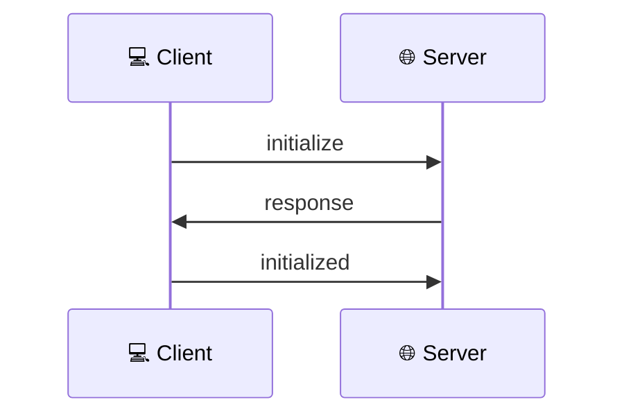
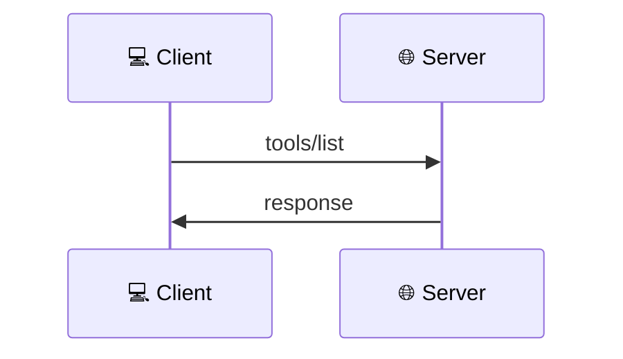
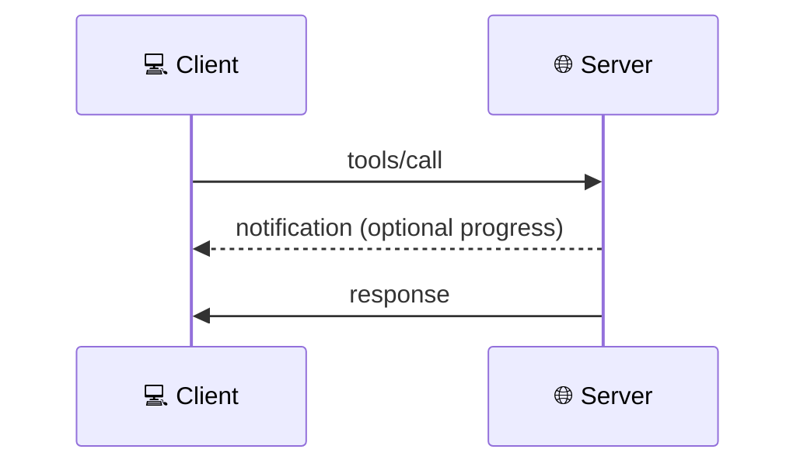
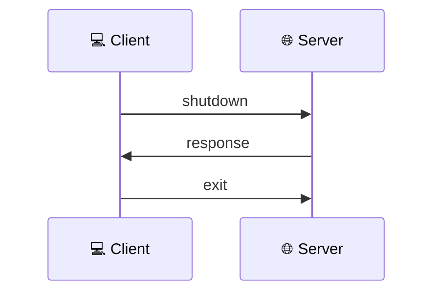

# The Interaction Lifecycle

In the previous section, we discussed the lifecycle of a single interaction between a Client and a Server. Let's now look at the complete interaction lifecycle in the context of the MCP protocol.

The MCP protocol defines a structured interaction lifecycle between Clients and Servers:

## 1. Initialization

The Client connects to the Server and they exchange protocol versions and capabilities, and the Server responds with its supported protocol version and capabilities.

The Client confirms the initialization is complete via a notification message.

## 2. Discovery

The Client requests information about available capabilities and the Server responds with a list of available tools.

This process could be repeated for each tool, resource, or prompt type.

## 3. Execution

The Client invokes capabilities based on the Host's needs.

## 4. Termination

The connection is gracefully closed when no longer needed and the Server acknowledges the shutdown request.

The Client sends the final exit message to complete the termination.